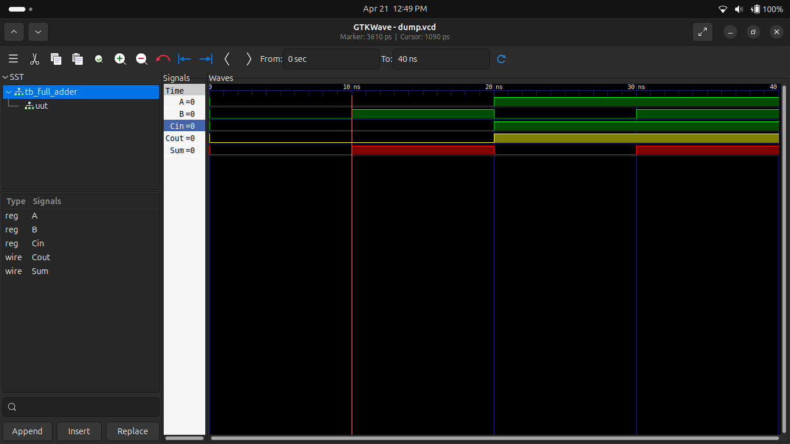
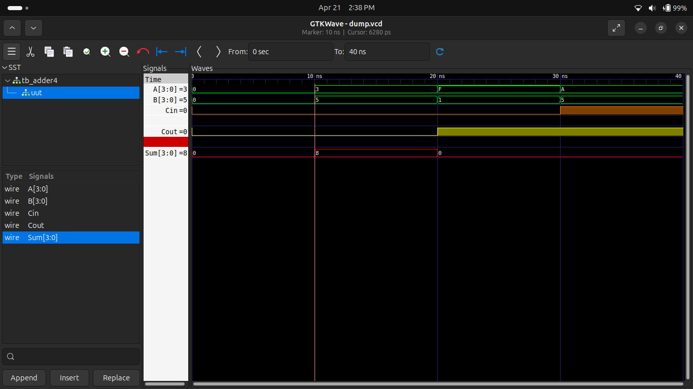

# Experiment 1: Full Adder & 4-bit Adder

# Full Adder

## Description

A full adder adds three inputs (A, B, Cin) and produces Sum and Carry output.

## Simulation

## 4-bit Adder

### Description

A 4-bit adder adds two 4-bit binary numbers along with carry input.

### Simulation Result

## Tools Used

* Icarus Verilog (for simulation)
* GTKWave (for waveform analysis)
