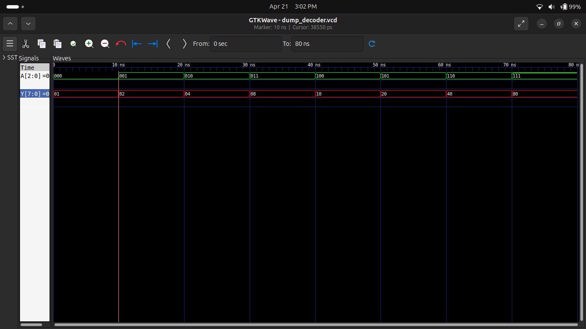
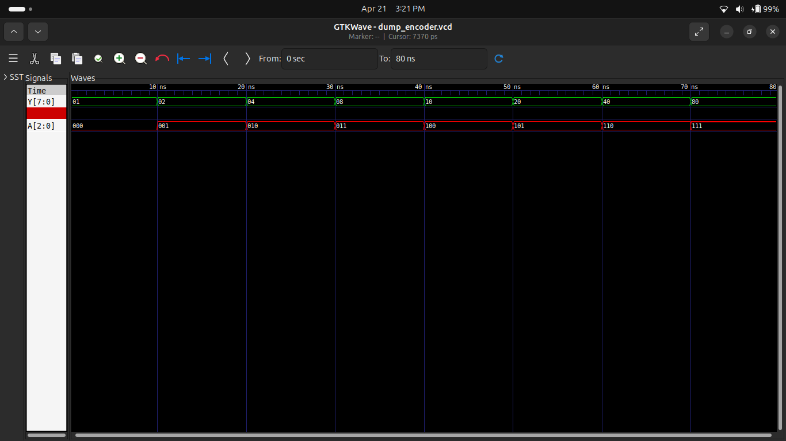

# Experiment 2: Encoder & Decoder

## 🔷 Objective
To design and simulate Encoder and Decoder circuits using Verilog HDL.

---

## 🔷 3-to-8 Decoder

### Description
A decoder converts binary input into one-hot output.
3 input lines → 8 output lines.

### Truth Table

| A2 A1 A0 | Output (Y) |
|----------|-----------|
| 000      | 00000001  |
| 001      | 00000010  |
| 010      | 00000100  |
| 011      | 00001000  |
| 100      | 00010000  |
| 101      | 00100000  |
| 110      | 01000000  |
| 111      | 10000000  |

### Simulation

---

## 🔷 8-to-3 Encoder

### Description
An encoder converts one-hot input into binary output.

### Truth Table

| Input (Y) | Output (A) |
|----------|-----------|
| 00000001 | 000       |
| 00000010 | 001       |
| 00000100 | 010       |
| 00001000 | 011       |
| 00010000 | 100       |
| 00100000 | 101       |
| 01000000 | 110       |
| 10000000 | 111       |

### Simulation

---

## 🔷 Tools Used
- Icarus Verilog
- GTKWave

---

## 🔷 Conclusion
Successfully designed and simulated Encoder and Decoder circuits using Verilog HDL.
