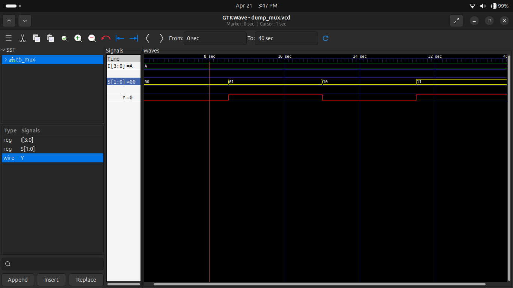
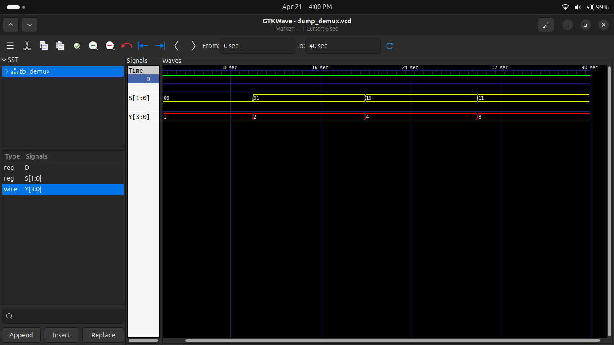

# Experiment 3: Multiplexer & Demultiplexer

## 🔷 Objective
To design and simulate Multiplexer and Demultiplexer using Verilog HDL.

---

## 🔷 4-to-1 Multiplexer

### Description
A multiplexer selects one input from multiple inputs based on select lines.

### Simulation

---

## 🔷 1-to-4 Demultiplexer

### Description
A demultiplexer routes a single input to one of many outputs.

### Simulation

---

## 🔷 Tools Used
- Icarus Verilog
- GTKWave

---

## 🔷 Conclusion
Successfully designed and simulated MUX and DEMUX circuits.
