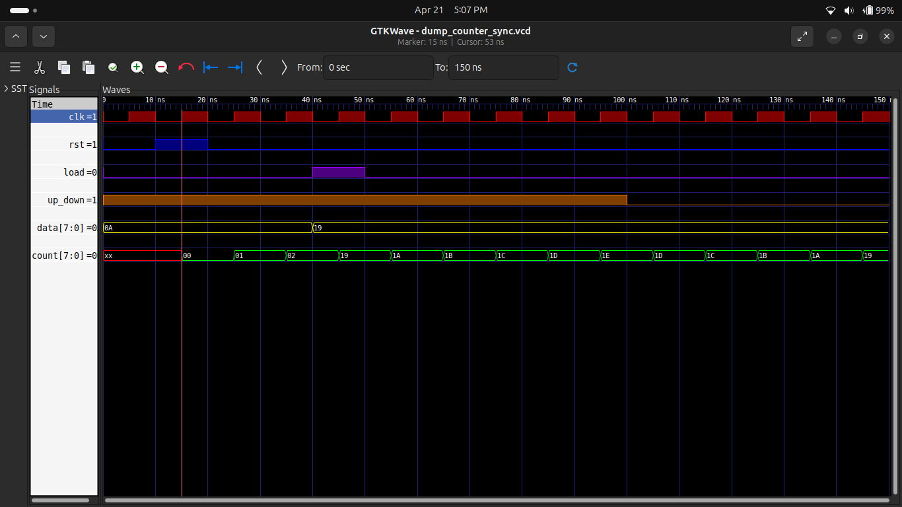

# 🧮 Experiment 4: 8-bit Up/Down Counter


---

## 🎯 Objective

Design and simulate an **8-bit Up/Down Counter** with:

* Asynchronous Reset
* Synchronous Load
* Up/Down Control
  using **Verilog HDL**

---

## 📘 Description

An 8-bit sequential circuit that:

* Counts **up (increment)**
* Counts **down (decrement)**
* Loads a custom value
* Resets instantly using asynchronous reset

---

## ⚙️ Features

* 🔢 8-bit Counter
* 🔄 Up/Down Control
* ⚡ Asynchronous Reset (Immediate)
* ⏱️ Synchronous Load (Clock-based)
* 🧪 Fully Simulated

---

## 🧠 Working Principle

The counter follows **priority-based operation**:

1. **Reset (Highest Priority)**

   * `rst = 1` → count = 0 (instant reset)

2. **Load**

   * `load = 1` → load input `data` at clock edge

3. **Counting**

   * `up_down = 1` → count increases
   * `up_down = 0` → count decreases

---

## 📊 Operation Table

| Condition   | Output Behavior |
| ----------- | --------------- |
| rst = 1     | count = 0       |
| load = 1    | count = data    |
| up_down = 1 | count++         |
| up_down = 0 | count--         |

---
## 🔍 Async vs Sync Comparison

| Feature | Async Reset | Sync Reset |
|--------|------------|-----------|
| Reset Timing | Immediate | Clock edge |
| Stability | Less | More |
| Design | Simple | Controlled |

## 🧩 Block Diagram


---

## ⏱️ Timing Behavior

* Reset works **asynchronously (instant)**
* Load occurs at **clock edge**
* Count updates on every **clock pulse**

---

## 🧾 Core Verilog Logic

```verilog
always @(posedge clk or posedge rst) begin
    if (rst)
        count <= 8'b0;
    else if (load)
        count <= data;
    else if (up_down)
        count <= count + 1;
    else
        count <= count - 1;
end
```

---

## 🧪 Simulation Result

### 🔹 Asynchronous Counter


### 🔹 Synchronous Counter

---

## 🛠️ Tools Used

* 💻 Verilog HDL
* ⚙️ Icarus Verilog
* 📊 GTKWave
* 🌐 GitHub

---

## 🌍 Applications

* Digital clocks
* Frequency counters
* Embedded systems
* Event counters

---

## 📌 Key Concepts

* Synchronous vs Asynchronous Control
* Sequential Logic Design
* Counter Design
* Clock-driven Circuits

---

## ✅ Conclusion

Successfully implemented and verified an **8-bit Up/Down Counter** with:

* Correct priority handling
* Accurate counting behavior
* Verified waveform output

---

## 👨‍💻 Author

**Pawan Kushwah**
B.Tech ECE, HNB Garhwal University
