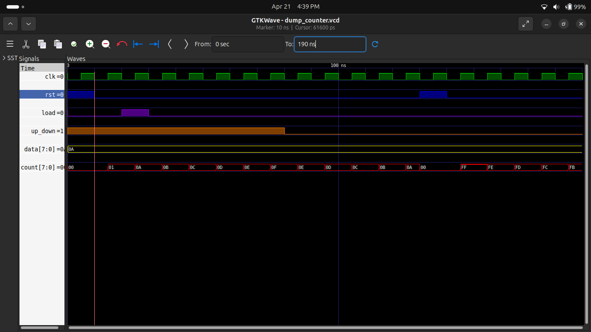

# 🧮 Experiment 4: 8-bit Up/Down Counter

## 🎯 Objective
Design and simulate an 8-bit up/down counter with:
- Asynchronous Reset
- Synchronous Load
- Up/Down Counting Control  
using Verilog HDL.

---

## 📘 Description
An 8-bit counter capable of:
- Counting Up (Increment)
- Counting Down (Decrement)
- Loading a custom value
- Immediate reset (asynchronous)

---

## ⚙️ Features
- 🔢 8-bit Counter
- 🔄 Up/Down Control
- ⚡ Asynchronous Reset (Immediate)
- ⏱️ Synchronous Load (Clock dependent)
- 🧪 Fully Simulated

---

## 🧠 Working Principle

The counter operates based on priority:

1. **Reset (Highest Priority)**
   - `rst = 1` → Counter resets to `0` instantly

2. **Load**
   - `load = 1` → Loads input `data` at next clock edge

3. **Count Operation**
   - `up_down = 1` → Count Up
   - `up_down = 0` → Count Down

---

## 📊 Operation Table

| Signal Condition | Output Behavior |
|----------------|---------------|
| rst = 1        | count = 0     |
| load = 1       | count = data  |
| up_down = 1    | count++       |
| up_down = 0    | count--       |

---

## 🧪 Simulation Result

> The waveform verifies:
- Reset works instantly  
- Load happens at clock edge  
- Up counting increases sequentially  
- Down counting decreases correctly  

---

## 🛠️ Tools Used
- 💻 Verilog HDL
- ⚙️ Icarus Verilog
- 📊 GTKWave
- 🌐 GitHub

---

## 📌 Key Concepts
- Synchronous vs Asynchronous Control
- Sequential Logic Design
- Counter Design
- Clock-driven circuits

---

## ✅ Conclusion
Successfully implemented and verified an **8-bit Up/Down Counter** with:
- Accurate counting behavior  
- Correct priority handling  
- Proper waveform validation  

---

## 👨‍💻 Author
**Pawan Kushwah**  
B.Tech ECE, HNB Garhwal University
