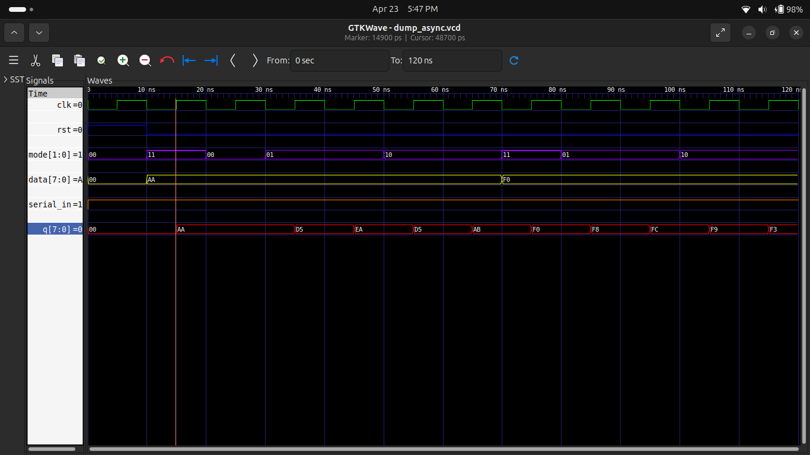
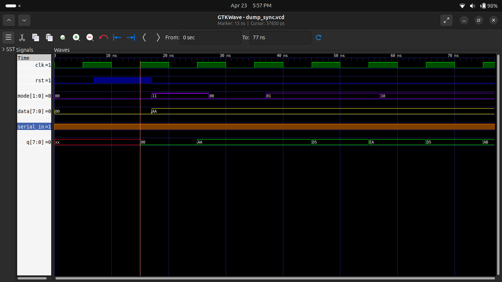

# 🧠 Experiment 5: 8-bit Universal Shift Register

## 🎯 Objective

To design and simulate an 8-bit Universal Shift Register with:

* Asynchronous Reset
* Synchronous Reset
* Synchronous Load
* Shift Left & Shift Right operations

---

## 📘 Description

A Universal Shift Register is a sequential circuit capable of performing multiple operations:

* Hold data
* Shift Left
* Shift Right
* Parallel Load

---

## ⚙️ Operations (Mode Control)

| Mode | Operation   |
| ---- | ----------- |
| 00   | Hold        |
| 01   | Shift Right |
| 10   | Shift Left  |
| 11   | Load        |

---

## 🔁 Working Principle

### 🔴 Asynchronous Version

* Reset happens **immediately**
* Independent of clock

### 🔵 Synchronous Version

* Reset happens **only at clock edge**
* More stable and controlled

---

## 🧪 Simulation Results

### 🔴 Asynchronous Shift Register

### 🔵 Synchronous Shift Register

---

## 🛠️ Tools Used

* Verilog HDL
* Icarus Verilog
* GTKWave
* GitHub

---

## 🧠 Key Concepts

* Sequential Logic Design
* Shift Registers
* Synchronous vs Asynchronous Control
* Clock-driven Circuits

---

## ✅ Conclusion

Successfully implemented and verified an 8-bit Universal Shift Register.
Simulation results confirm correct:

* Load operation
* Shift Left / Right
* Reset behavior

---

## 👨‍💻 Author

**Pawan Kushwah**
B.Tech ECE, HNBGU
