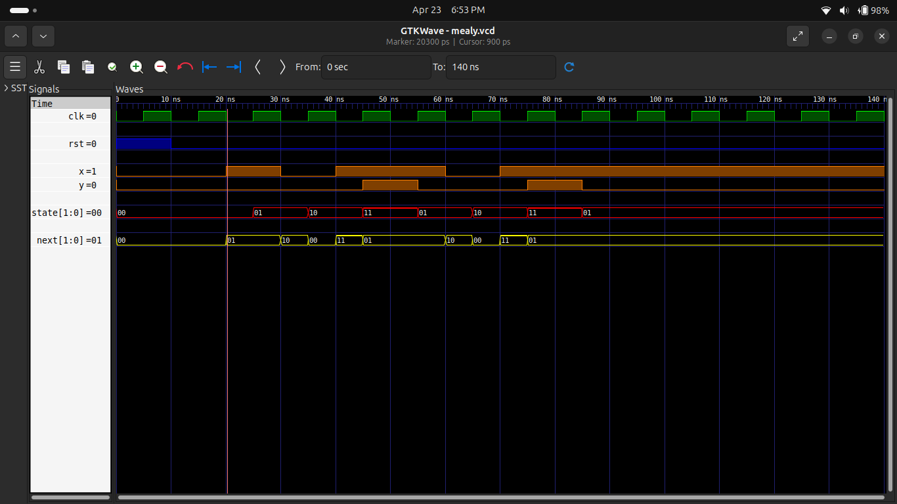
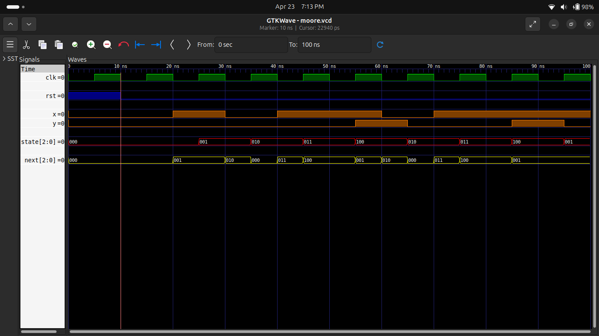

# 🔁 Experiment 6: Mealy & Moore FSM (Sequence Detector)

## 🎯 Objective
To design and simulate Mealy and Moore type sequence detector using Verilog HDL.

---

## 🧠 Description

A Finite State Machine (FSM) is a sequential circuit that transitions between states based on input and clock.

### 🔹 Mealy Machine
- Output depends on **state + input**
- Faster response (no delay)

### 🔹 Moore Machine
- Output depends on **only state**
- Output changes after clock edge (delay)

---

## ⚙️ Files Included

- `mealy_seq.v` → Mealy FSM design  
- `moore_seq.v` → Moore FSM design  
- `tb_mealy.v` → Mealy testbench  
- `tb_moore.v` → Moore testbench  
- `waveform_mealy.png` → Mealy output  
- `waveform_moore.png` → Moore output  

---

## 🔄 State Behavior

### Mealy FSM
- Output changes immediately when input condition is met

### Moore FSM
- Output changes only after state transition

---

## 🧪 Simulation

Simulation done using:
- Icarus Verilog  
- GTKWave  

---

## 📊 Results

### 🔹 Mealy FSM Output

### 🔹 Moore FSM Output

---

## 🔍 Key Difference

| Feature | Mealy | Moore |
|--------|------|------|
| Output Dependence | State + Input | Only State |
| Output Timing | Immediate | Delayed |
| Speed | Faster | Slower |
| Stability | Less | More |

---

## 🧠 Key Concepts

- Finite State Machine (FSM)
- Sequential Logic
- State Transition
- Mealy vs Moore Model

---

## ✅ Conclusion

Successfully implemented and verified both Mealy and Moore FSM sequence detectors.  
Simulation confirms correct state transitions and output behavior.

---

## 👨‍💻 Author

**Pawan Kushwah**  
B.Tech Electronics & Communication Engineering  
HNB Garhwal University
