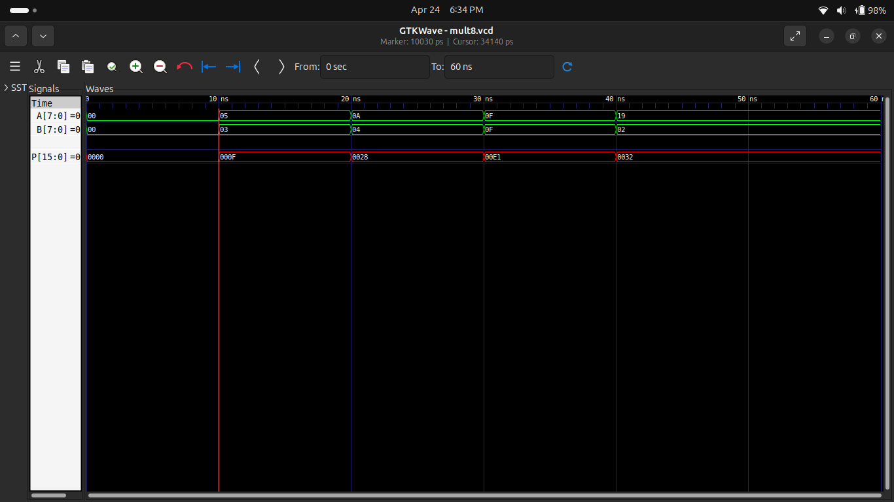
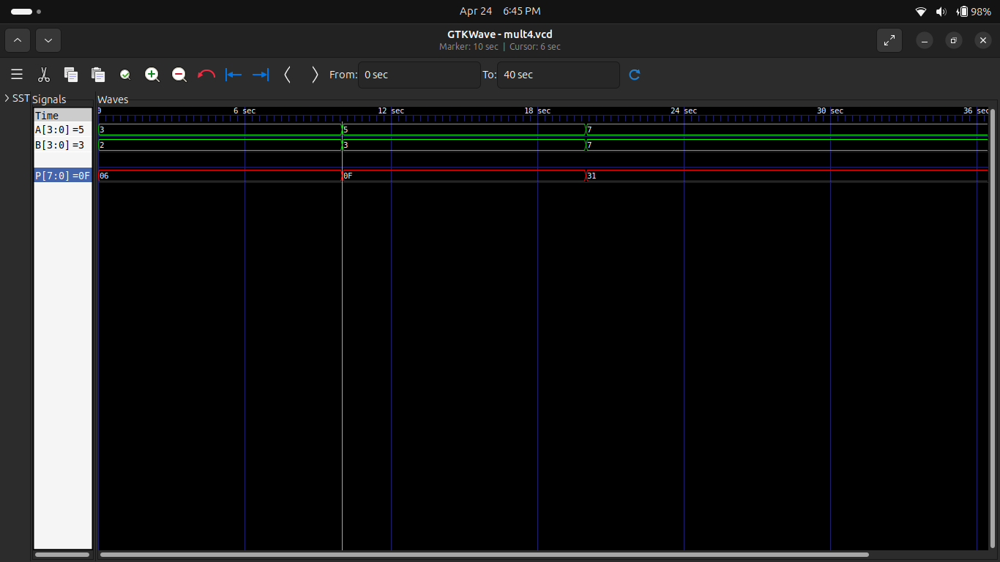

#  Experiment 7: 8-bit Multiplier & 4-bit Multiplier (FPGA)

## 🎯 Objective
To design and simulate an 8-bit multiplier and implement a 4-bit multiplier using Verilog HDL and FPGA.

---

## 🧠 Description

A multiplier is a combinational circuit that performs multiplication of binary numbers.

- 8-bit multiplier → produces 16-bit output
- 4-bit multiplier → produces 8-bit output

---

## ⚙️ Files Included

- `multiplier_8bit.v` → 8-bit multiplier design  
- `tb_multiplier_8bit.v` → Testbench for 8-bit multiplier  
- `multiplier_4bit.v` → 4-bit multiplier design  
- `tb_multiplier_4bit.v` → Testbench for 4-bit multiplier  
- `top_multiplier.v` → FPGA implementation  
- `waveform_8bit.png` → Simulation result (8-bit)  
- `waveform_4bit.png` → Simulation result (4-bit)  

---

## 🔢 Working Principle

Multiplication is performed using:

P = A × B

- 8-bit × 8-bit → 16-bit result  
- 4-bit × 4-bit → 8-bit result  

---

## 🧪 Simulation

Simulation performed using:
- Icarus Verilog  
- GTKWave  

---

## 📊 Results

### 🔹 8-bit Multiplier Output

### 🔹 4-bit Multiplier Output

---

## 🔌 FPGA Implementation (4-bit)

### Inputs:
- Switches → A[3:0], B[3:0]

### Outputs:
- LEDs → Product P[7:0]

---

## 🔍 Key Concepts

- Binary Multiplication  
- Combinational Logic  
- Parallel Processing  
- FPGA Mapping  

---

## ✅ Conclusion

Successfully designed and simulated 8-bit and 4-bit multipliers.  
The FPGA implementation verifies correct multiplication using hardware switches and LEDs.

---

## 👨‍💻 Author

**Pawan Kushwah**  
B.Tech Electronics & Communication Engineering  
HNB Garhwal University
