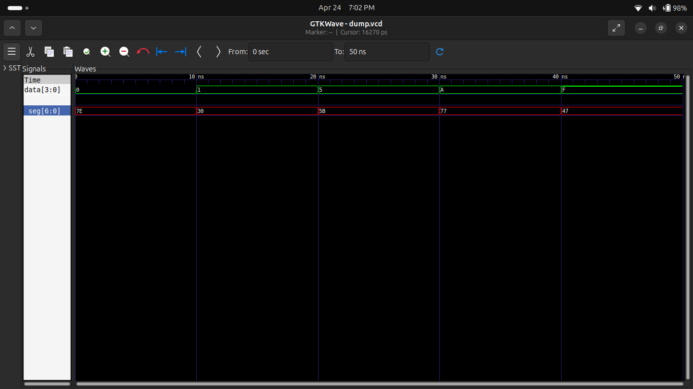

# 🔢 Experiment 8: 7-Segment Display Interfacing

## 🎯 Objective
To design and simulate a 7-segment display decoder for hexadecimal digits (0–F) using Verilog HDL.

---

## 📖 Description
A 7-segment display is used to represent numeric and hexadecimal values.  
This project implements a combinational logic circuit that converts a 4-bit binary input into corresponding segment control signals (a–g).

---

## ⚙️ Features
- ✔ Supports HEX digits (0–F)
- ✔ Combinational logic design
- ✔ FPGA compatible
- ✔ Easy integration with digital systems

---

## 🔢 Segment Mapping (Common Cathode)

| Hex | Segments ON | Code (abcdefg) |
|-----|------------|----------------|
| 0 | a b c d e f | 1111110 |
| 1 | b c | 0110000 |
| 2 | a b d e g | 1101101 |
| 3 | a b c d g | 1111001 |
| 4 | b c f g | 0110011 |
| 5 | a c d f g | 1011011 |
| 6 | a c d e f g | 1011111 |
| 7 | a b c | 1110000 |
| 8 | all | 1111111 |
| 9 | a b c d f g | 1111011 |
| A | a b c e f g | 1110111 |
| B | c d e f g | 0011111 |
| C | a d e f | 1001110 |
| D | b c d e g | 0111101 |
| E | a d e f g | 1001111 |
| F | a e f g | 1000111 |

---

## 🧠 Working Principle
- A 4-bit binary input is provided
- A combinational `case` statement maps input to segment pattern
- Output drives 7 LEDs (a–g) of display

---

## 🧪 Simulation

### 🔹 Inputs Tested:

### 🔹 Output:
- Correct segment patterns observed
- Output updates instantly with input change

---

## 📊 Waveform

---

## 🛠️ Tools Used
- Verilog HDL
- Icarus Verilog (Simulation)
- GTKWave (Waveform Analysis)
- GitHub (Version Control)

---

## 📌 Applications
- Digital clocks
- Embedded systems
- FPGA display systems
- Calculator / ALU outputs

---

## 🚀 Future Improvements
- Multi-digit display (Multiplexing)
- Decimal (BCD) display
- Integration with counters / ALU

---

## ✅ Conclusion
Successfully designed and simulated a 7-segment display decoder.  
The waveform verifies correct hexadecimal representation for all test inputs.

---

## 👨‍💻 Author
**Pawan Kushwah**  
B.Tech Electronics & Communication Engineering  
HNB Garhwal University
