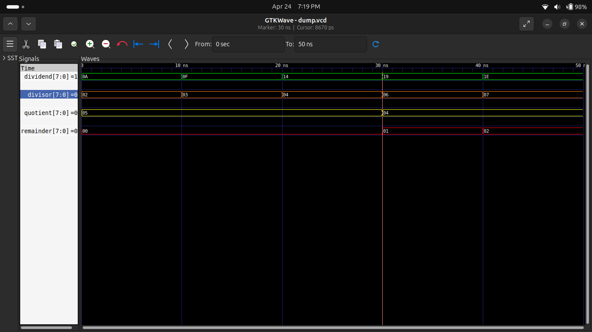

# ➗ Experiment 9: 8-bit Divider

## 🎯 Objective

To design and simulate an 8-bit divider using Verilog HDL that computes:

* Quotient
* Remainder

---

## 📖 Description

This project implements a combinational 8-bit divider.
It takes an 8-bit dividend and an 8-bit divisor as inputs and produces:

* Quotient = Dividend / Divisor
* Remainder = Dividend % Divisor

The design also handles division-by-zero safely.

---

## ⚙️ Features

* ✔ 8-bit Divider
* ✔ Outputs Quotient and Remainder
* ✔ Division-by-zero protection
* ✔ Fully simulated using Icarus Verilog
* ✔ Verified using GTKWave

---

## 🧠 Working Principle

The divider uses built-in arithmetic operators:

* `/` → Division (Quotient)
* `%` → Modulus (Remainder)

Condition:

* If divisor = 0 → Output = 0 (safe handling)

---

## 🔢 Test Cases

| Dividend | Divisor | Quotient | Remainder |
| -------- | ------- | -------- | --------- |
| 10       | 2       | 5        | 0         |
| 15       | 3       | 5        | 0         |
| 20       | 4       | 5        | 0         |
| 25       | 6       | 4        | 1         |
| 30       | 7       | 4        | 2         |

---

## 🧪 Simulation

### ✔ Observations:

* Quotient calculated correctly
* Remainder matches expected values
* Stable outputs for all test cases

---

## 📊 Waveform

---

## 🛠️ Tools Used

* Verilog HDL
* Icarus Verilog
* GTKWave
* GitHub

---

## 📌 Applications

* Arithmetic Logic Unit (ALU)
* Digital signal processing
* Embedded systems
* FPGA-based computation units

---

## 🚀 Future Scope

* Sequential Divider (FSM based)
* Restoring / Non-Restoring Division
* FPGA hardware implementation

---

## ✅ Conclusion

Successfully designed and simulated an 8-bit divider.
Waveform results confirm correct computation of quotient and remainder.

---

## 👨‍💻 Author

**Pawan Kushwah**
B.Tech Electronics & Communication Engineering
HNB Garhwal University
