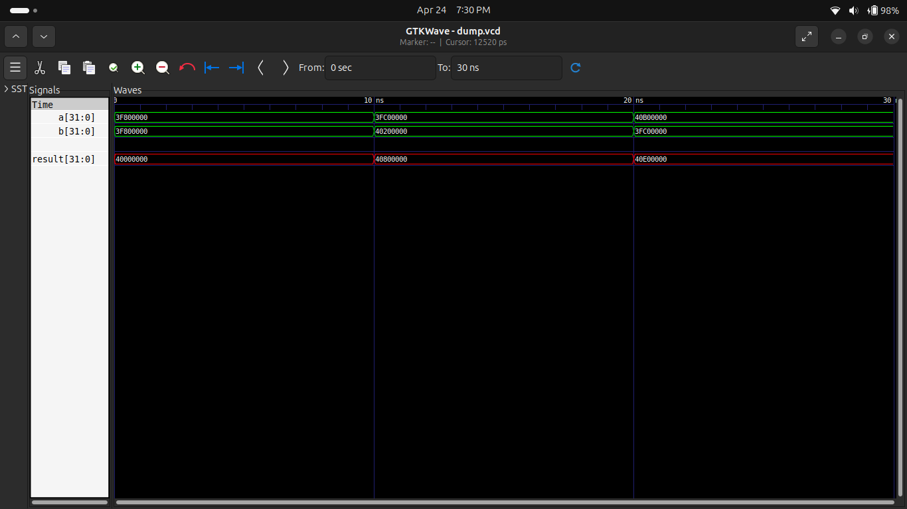

# 🧮 Experiment 10: Floating Point Adder (IEEE-754)

## 🎯 Objective

To design and simulate a 32-bit floating point adder using IEEE-754 single precision format in Verilog HDL.

---

## 📖 Description

This project implements a floating point adder that performs addition of two 32-bit IEEE-754 numbers.

Each number consists of:

* 1-bit Sign
* 8-bit Exponent
* 23-bit Mantissa

The design performs:

* Exponent alignment
* Mantissa addition/subtraction
* Normalization

---

## ⚙️ Features

* ✔ IEEE-754 single precision (32-bit)
* ✔ Handles positive and negative numbers
* ✔ Exponent alignment
* ✔ Mantissa addition/subtraction
* ✔ Normalization step implemented
* ✔ Fully simulated

---

## 🧠 Working Principle

### Step 1: Decomposition

Split input into:

* Sign
* Exponent
* Mantissa

### Step 2: Exponent Alignment

* Smaller exponent mantissa is right shifted

### Step 3: Mantissa Operation

* Same sign → Addition
* Different sign → Subtraction

### Step 4: Normalization

* Adjust mantissa and exponent

---

## 🧪 Test Cases

| A   | B   | Result |
| --- | --- | ------ |
| 1.0 | 1.0 | 2.0    |
| 1.5 | 2.5 | 4.0    |
| 5.5 | 1.5 | 7.0    |

---

## 📊 Waveform

---

## 🛠️ Tools Used

* Verilog HDL
* Icarus Verilog
* GTKWave
* GitHub

---

## 📌 Applications

* Floating Point Unit (FPU)
* Scientific computation
* DSP systems
* Graphics processing

---

## ⚠️ Limitations

* No rounding modes implemented
* No NaN / Infinity handling
* No denormal numbers support

---

## 🚀 Future Scope

* Fully IEEE-754 compliant design
* Floating point multiplier
* Floating point ALU

---

## ✅ Conclusion

Successfully designed and simulated a floating point adder.
Waveform verifies correct IEEE-754 addition operation.

---

## 👨‍💻 Author

**Pawan Kushwah**
B.Tech Electronics & Communication Engineering
HNB Garhwal University
