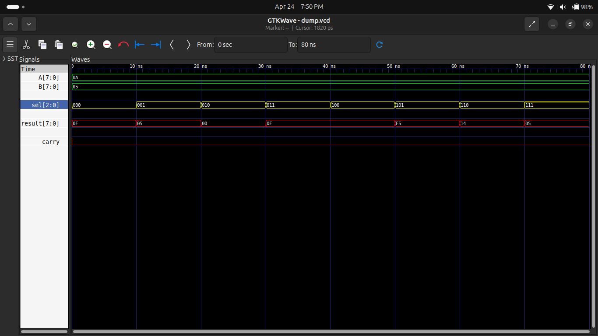

# 🧠 Experiment 11: 8-bit ALU (Arithmetic Logic Unit)

## 🎯 Objective
To design and simulate an 8-bit ALU using Verilog HDL that performs arithmetic and logical operations.

---

## 📘 Description
An ALU (Arithmetic Logic Unit) is a fundamental component of digital systems and processors.  
It performs operations such as addition, subtraction, and logical functions.

This design implements an 8-bit ALU controlled by a 3-bit select signal.

---

## ⚙️ Operations Supported

| sel | Operation |
|-----|----------|
| 000 | Addition (A + B) |
| 001 | Subtraction (A - B) |
| 010 | AND |
| 011 | OR |
| 100 | XOR |
| 101 | NOT (A) |
| 110 | Shift Left |
| 111 | Shift Right |

---

## 🧩 Inputs & Outputs

- **Inputs:**
  - A [7:0]
  - B [7:0]
  - sel [2:0]

- **Outputs:**
  - result [7:0]
  - carry

---

## 🔁 Working Principle

- ALU performs operation based on `sel`
- Arithmetic operations generate carry
- Logical operations ignore carry (set to 0)
- Shift operations modify bit positions

---

## 📊 Simulation

### Inputs:
- A = 10 (0A)
- B = 5 (05)

### Output Verification:

| Operation | Result |
|----------|--------|
| ADD | 15 |
| SUB | 5 |
| AND | 0 |
| OR | 15 |
| XOR | 15 |
| NOT | F5 |
| SHL | 14 |
| SHR | 5 |

---

## 🖥️ Waveform

---

## 🛠️ Tools Used

- Verilog HDL
- Icarus Verilog
- GTKWave
- GitHub

---

## 🚀 Applications

- CPU Design
- Digital Systems
- Embedded Systems
- FPGA Projects

---

## ✅ Conclusion

Successfully designed and simulated an 8-bit ALU.  
All arithmetic and logical operations are verified using waveform analysis.

---

## 👨‍💻 Author

**Pawan Kushwah**  
B.Tech ECE, HNBGU
