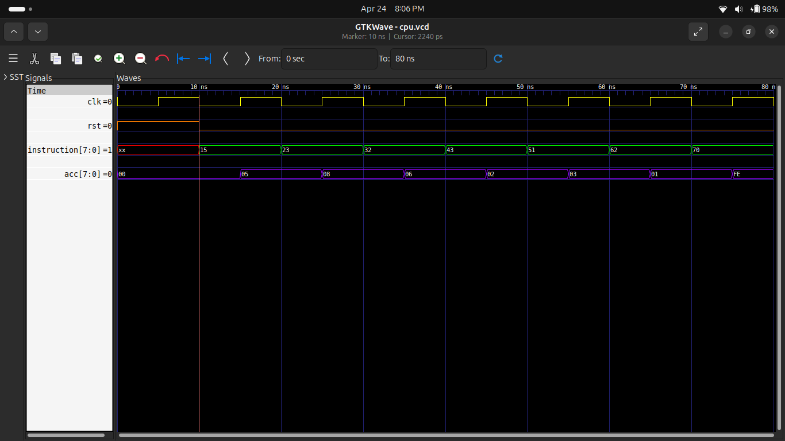

# 🧠 Experiment 12: Simple 8-bit CPU (CU + ALU)

## 🎯 Objective
To design and simulate a simple 8-bit CPU using Verilog HDL that integrates a Control Unit (CU) and Arithmetic Logic Unit (ALU).

---

## 📘 Description
This project implements a basic CPU capable of executing instructions using an accumulator-based architecture.

- The **Control Unit (CU)** decodes instructions
- The **ALU** performs operations
- The **Accumulator (ACC)** stores results

---

## 🧩 Instruction Format

Instruction = 8-bit

| Bits | Description |
|------|------------|
| [7:4] | Opcode |
| [3:0] | Data |

---

## ⚙️ Instruction Set

| Opcode | Instruction | Description |
|--------|------------|------------|
| 0001 | LOAD | ACC = data |
| 0010 | ADD | ACC = ACC + data |
| 0011 | SUB | ACC = ACC - data |
| 0100 | AND | ACC = ACC & data |
| 0101 | OR  | ACC = ACC \| data |
| 0110 | XOR | ACC = ACC ^ data |
| 0111 | NOT | ACC = ~ACC |

---

## 🔁 Working Principle

1. Instruction is fetched
2. Control Unit decodes opcode
3. ALU performs operation
4. Result is stored in accumulator

---

## 📊 Simulation

### Test Sequence

| Instruction | Operation | Result |
|------------|----------|--------|
| 0001 0101 | LOAD 5 | 05 |
| 0010 0011 | ADD 3 | 08 |
| 0011 0010 | SUB 2 | 06 |
| 0100 0011 | AND 3 | 02 |
| 0101 0001 | OR 1 | 03 |
| 0110 0010 | XOR 2 | 01 |
| 0111 0000 | NOT | FE |

---

## 🖥️ Waveform

---

## 🛠 Tools Used

- Verilog HDL  
- Icarus Verilog  
- GTKWave  
- GitHub  

---

## 🚀 Applications

- Processor Design
- Embedded Systems
- FPGA Development
- Digital System Design

---

## ✅ Conclusion

Successfully designed and simulated a simple CPU using Verilog.  
Instruction decoding and ALU operations are verified through waveform analysis.

---

## 👨‍💻 Author

**Pawan Kushwah**  
B.Tech ECE, HNBGU
